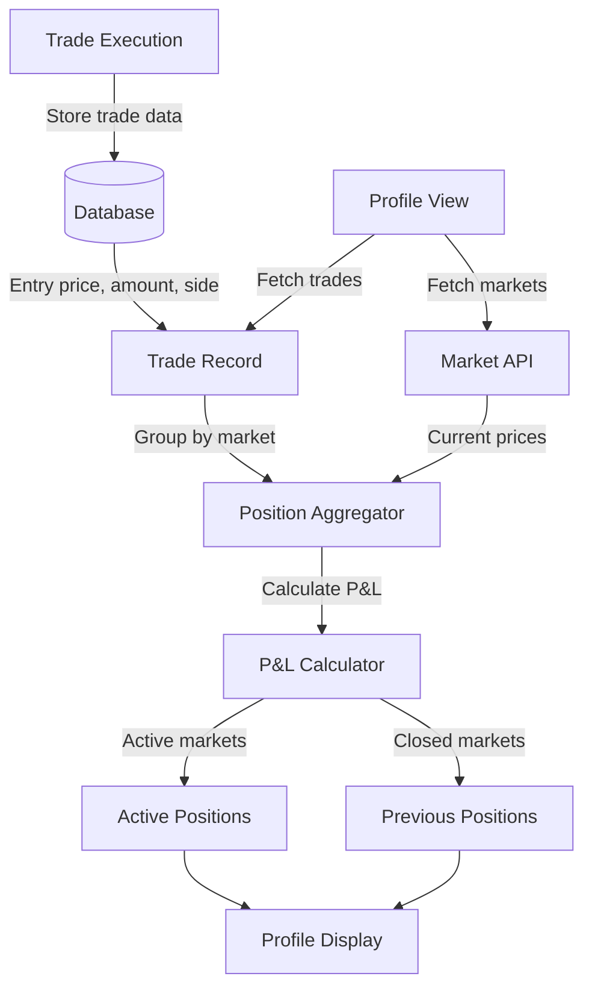

# Trade Position Profit/Loss Tracking Implementation

## Overview

Implement a complete trade position tracking system that calculates profit/loss by comparing entry prices against current market prices, with separate views for active and previous positions based on market status.

## Architecture




## Database Changes

### 1. Update Trade Schema ([prisma/schema.prisma](prisma/schema.prisma))

Add new fields to the `Trade` model:

- `entryPrice` (Decimal): Price per token at execution
- `tokenAmount` (Decimal): Number of tokens received
- `usdcAmount` (Decimal): USDC spent on trade

This allows us to calculate:

- **Entry Value**: `usdcAmount` (what user paid)
- **Current Value**: `tokenAmount * currentMarketPrice`
- **P&L**: `currentValue - entryValue`

### 2. Migration Strategy

Create a migration to add these fields with nullable defaults for existing trades.

## Backend Implementation

### 3. Update Trade Creation ([app/lib/tradeService.ts](app/lib/tradeService.ts))

Modify `createTrade` function to:

- Accept `entryPrice`, `tokenAmount`, and `usdcAmount` parameters
- Store these values in the database
- Maintain backward compatibility with existing trades

### 4. Update Trade API ([app/api/trades/route.ts](app/api/trades/route.ts))

Enhance POST endpoint to:

- Extract execution details from transaction signature
- Calculate entry price from order quote response
- Store comprehensive trade data

### 5. Create Position Aggregation Service ([app/lib/positionService.ts](app/lib/positionService.ts))

New service to:

- Aggregate trades by market ticker and side
- Calculate total entry cost and token amounts
- Fetch current market prices
- Compute profit/loss for each position
- Separate positions by market status (active vs previous)

**Key functions:**

- `getUserPositions(userId)`: Returns aggregated positions with P&L
- `calculatePositionPL(trades, currentPrice)`: Computes P&L metrics
- `separateByMarketStatus(positions, markets)`: Splits active/previous

### 6. Create Positions API Endpoint ([app/api/positions/route.ts](app/api/positions/route.ts))

New endpoint `GET /api/positions?userId={userId}` that:

- Fetches user's trades
- Aggregates positions
- Fetches current market data
- Returns positions with P&L calculations
- Includes market metadata (title, subtitle, event info)

## Frontend Implementation

### 7. Create Position Display Component ([app/components/UserPositions.tsx](app/components/UserPositions.tsx))

Enhance existing component to:

- Display event title with market subtitle
- Show YES/NO position with entry price
- Display current market price
- Calculate and show P&L (absolute and percentage)
- Color-code profits (green) and losses (red)
- Tab interface for Active vs Previous positions

**Display format per position:**

```javascript
[Event Image] Event Title
              Market Subtitle
              YES at $0.65 → $0.72 (+$45.50, +10.8%)
              or
              NO at $0.35 → $0.28 (-$22.30, -20.0%)
```


### 8. Update Trade Placement Flow ([app/components/TradeMarket.tsx](app/components/TradeMarket.tsx))

Modify `handlePlaceOrder` to:

- Extract entry price from order response
- Calculate token amount from transaction
- Pass complete trade data to API
- Store `entryPrice`, `tokenAmount`, `usdcAmount`

### 9. Update Profile Page ([app/components/Profile.tsx](app/components/Profile.tsx))

Replace or enhance `UserTrades` component with:

- New `UserPositions` component for aggregated view
- Separate tabs for "Active Positions" and "Previous Positions"
- Summary stats: Total P&L, Win Rate, Active Positions Count

### 10. Create Position Card Component ([app/components/PositionCard.tsx](app/components/PositionCard.tsx))

Reusable component displaying:

- Event image and title
- Market subtitle
- Position side (YES/NO) with badge
- Entry price and current price
- P&L with color coding
- Click to navigate to market details

## Data Flow

### Trade Placement Flow

1. User places trade via `TradeMarket` component
2. Order quote obtained from DFlow API
3. Transaction signed and submitted
4. On confirmation, extract execution price
5. Store trade with `entryPrice`, `tokenAmount`, `usdcAmount`

### Position Display Flow

1. Profile loads user trades from database
2. Fetch current market data for all traded markets
3. Aggregate trades by market and side
4. Calculate P&L using entry vs current prices
5. Separate by market status (active/previous)
6. Display in respective tabs

## Key Calculations

**Entry Price Calculation:**

```typescript
entryPrice = usdcAmount / tokenAmount
```

**Current Value:**

```typescript
currentValue = tokenAmount * currentMarketPrice
```

**Profit/Loss:**

```typescript
absolutePL = currentValue - usdcAmount
percentagePL = (absolutePL / usdcAmount) * 100
```

**Market Status Determination:**

- Active: `market.status === 'active' || market.status === 'open'`
- Previous: `market.status === 'closed' || market.status === 'settled'`

## Files to Create/Modify

**Create:**

- `app/lib/positionService.ts` - Position aggregation and P&L logic
- `app/api/positions/route.ts` - Positions API endpoint
- `app/components/PositionCard.tsx` - Individual position display
- New Prisma migration for schema changes

**Modify:**

- `prisma/schema.prisma` - Add trade fields
- `app/lib/tradeService.ts` - Update trade creation
- `app/api/trades/route.ts` - Store execution details
- `app/components/TradeMarket.tsx` - Extract and pass execution data
- `app/components/UserPositions.tsx` - Enhanced position display
- `app/components/Profile.tsx` - Integrate new position views

## Performance Considerations

1. **Caching**: Cache market data fetches (already implemented in `api.ts`)
2. **Batch Requests**: Use batch market endpoint for multiple markets
3. **Pagination**: Implement pagination for large trade histories
4. **Optimistic Updates**: Show estimated P&L while fetching latest prices

## Edge Cases